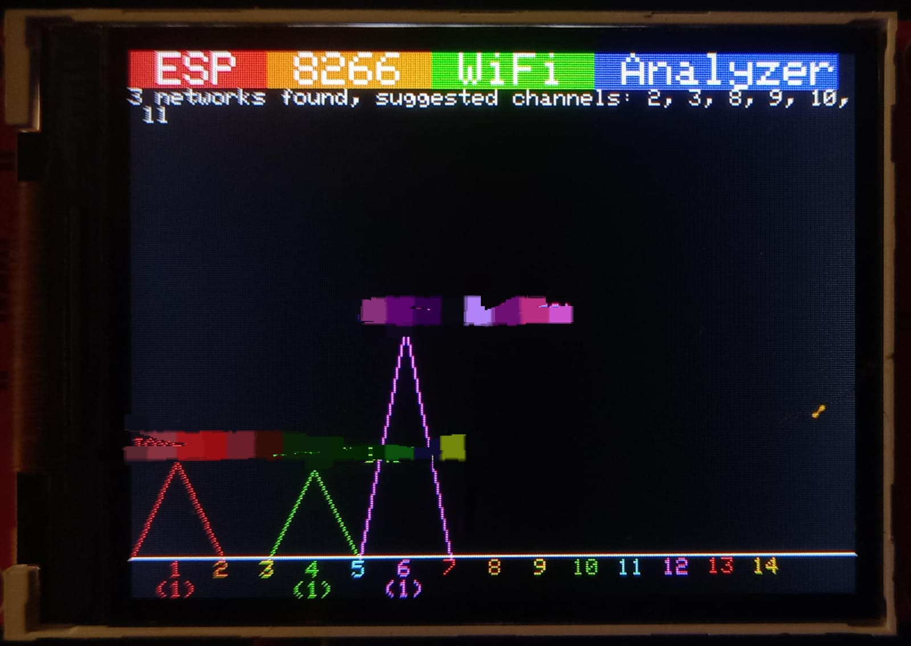
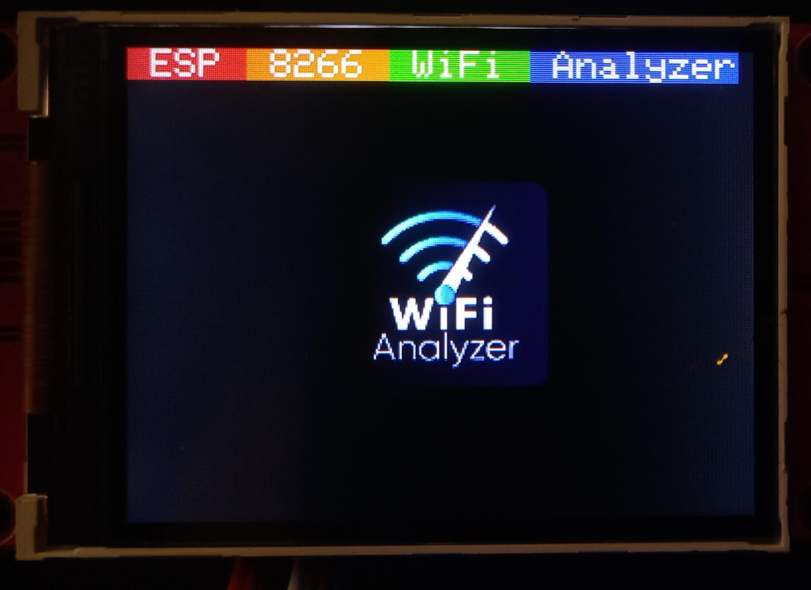

# ESP8266 WiFi Analyzer

The ESP8266 WiFi Analyzer project can be found originally [here](https://github.com/moononournation/ESP8266WiFiAnalyzer). However, for organizational purposes, I created my own repoisotry because i wanted to add a *Pause Scan* feature and also added a splash screen logo.

*Preview*

# Features

- Wifi Scan: Scan and visualize the WiFi signal information around you.
- Pause Scan: Pauses scanning to hold the current Signal inofrmations on screen until resumed.
- Deep Sleep: The ESP8266 goes into a deep sleep mode and turns off the screen after a set amount of scans, suited for battery poower devices **(Disabled by default, to enable open the <u>.ino</u> file in Arduino IDE and uncomment the requred lines )**.
- Splash screen: Shows a logo and the name banner at start (is this a feature tho? lol)

*Splash Screen*

## Hardware

This project requires the following hardware in order to work:

* Any ESP8266 Board or module
* Jumper Wires
* Breadboard or Prototype board
* 1 Momentary push button switch [here](https://robu.in/product/6x6x5-tactile-push-button-switch/).

Display there are two options available:
* 2.4" TFT Screen with ILI9341 driver IC (Touch not required)
    - [Module 1](https://robu.in/product/2-4-inch-spi-interface-240x320-touch-screen-tft-display-module/)
    - [Module 2](https://robu.in/product/2-8-inch-spi-screen-module-tft-interface-240-x-320-without-touch/)
    - [Module 2](https://robu.in/product/2-8-inch-spi-touch-screen-module-tft-interface-240320/)
* 1.8" TFT Screen with ST7735 driver IC
     - [Module 1](https://aws.robu.in/product/62060/)
     - [Module 2](https://robu.in/product/blue-1-8-inch-st7735-tft-lcd-module-with-4-io-128160/)
     - [Module 3](https://robu.in/product/1-8-inch-spi-128160-tft-lcd-display-module-pcb-arduino/)

Popular ESPP8266 dev boards:

- [ESP8266 NodeMCU V1](https://aws.robu.in/product/nodemcu-cp2102-board/)
- [ESP8266 NodeMCU V3](https://aws.robu.in/product/nodemcu-esp8266-v3-lua-ch340-wifi-dev-board/)
- [Wemos D1 mini](https://robu.in/product/d1-mini-v2-nodemcu-4m-bytes-lua-wifi-internet-of-things-development-board-based-esp8266/)
- [Adafruit Feather HUZZAH](https://www.adafruit.com/product/3046)
- [Adafruit HUZZAH ESP8266 Breakout](https://www.adafruit.com/product/2471)
- [ESP-13 expansion sheild for Arduino UNO](https://aws.robu.in/product/esp8266-web-server-serial-wifi-extension-board-shield-esp-13/)

### Connections

Make the following connections between your 2.4" TFT Screen and your ESP8266 board:

| 2.4" TFT | ESP8266     |
| -------- | ----------- |
| VCC      | VIN/3v3     |
| GND      | GND         |
| CS       | D8 (GPIO15) |
| RESET    | RST         |
| D/C      | D1 (GPIO5)  |
| MOSI     | D7 (GPIO13) |
| SCK      | D5 (GPIO14) |
| LED      | 3V3         |

For using the Deep Sleep Feature make these connetions (different form the connections in the Instructables guide):

| 2.4" TFT | ESP8266     |
| -------- | ----------- |
| VCC      | D4 (GPIO2)  |
| GND      | GND         |
| CS       | D8 (GPIO15) |
| RESET    | RST         |
| D/C      | D1 (GPIO5)  |
| MOSI     | D7 (GPIO13) |
| SCK      | D5 (GPIO14) |
| LED      | D6 (GPIO12) |

Make these conections for toggling Scan pause with the push button switch (not included in the Instructables guide):

| Push Button | ESP8266    |
| ----------- | ---------- |
| PIN 1       | GND        |
| PIN 2       | D2 (GPIO4) |

# Installation

To install/flash the firmware to your esp8266 board there are 2 methods, you can either use a esp flasher tool to flash the binary or use Arduino IDE.

### Method: ESP Flasher Tool

- There are two softwares you can use for this [NodeMCU-Flasher](https://github.com/nodemcu/nodemcu-flasher) and [Spacehuhn's ESPWebTool](https://esp.huhn.me) (Recommended).
- Choose your sofware of choice.
- Click on connect button and select the COM port of your ESP8266 dev board for <u>ESPWebTool</u> or just select the COM port of your board from the drop down list on the <u>NodeMCU-Flasher</u>.
- Download the latest bin file from [here](https://github.com/TriDEntApollO/ESP8266_WiFi_Analyzer/releases/tag/v0.2.2).
- Select offset <u>0x00000</u> and upload the <u>bin</u> file to the selected offset.
- Click the Flash/Program button and wait for few mins to finish uploading the firmware.

### Method: Arduino IDE

- Install Arduino IDE from [here](https://www.arduino.cc/en/software).
- Install Required Board manager:
  - Open Arduino IDE and open Preferences (Click on File -> Preferences)
  - Copy and paste this URL in the <u>Aditional boards manager URLs section</u> http://arduino.esp8266.com/stable/package_esp8266com_index.json
  - Restart Arduino IDE.
  - Go to board manager and search for [esp8266](https://github.com/esp8266/Arduino) by ESP8266 Community and install it.
- Install required libraries:
  - Go to library manager.
  - Search for [Adafruit ST7735](https://github.com/adafruit/Adafruit-ST7735-Library) and install it.
  - Search for [Adafruit ILI9341](https://github.com/adafruit/Adafruit_ILI9341) and install it.
- From the dropdown menu at the top right side of the screen belo the title bar Select your ESP8266 dev baord and COM port (modify these seetings form the Tools section in the title bar).
- Click on upload (The Arrow button at the top right corner of the screen) and wait for it to finish.

## Please find more details at instructables

[ESP8266 WiFi Analyzer](https://www.instructables.com/ESP8266-WiFi-Analyzer/)

[Portable WiFi Analyzer](https://www.instructables.com/id/Portable-WiFi-Analyzer/)